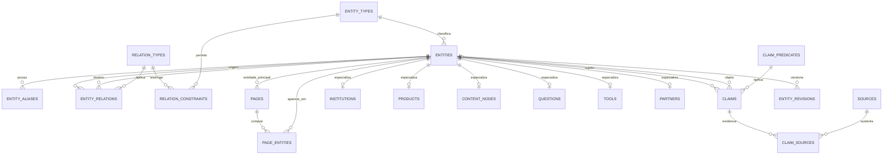
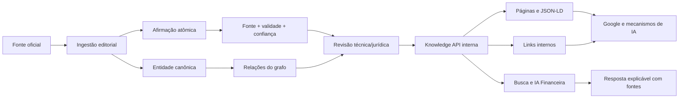

# ORÁCULO — Entity Database e Knowledge Graph

Status: arquitetura da Sprint 4.1  
Data: 13 de julho de 2026  
Escopo: fundação interna; nenhuma página ou funcionalidade pública nova

## 1. Decisão arquitetural

O ORÁCULO usará um **grafo de conhecimento híbrido sobre PostgreSQL**:

1. Uma tabela universal de entidades dá identidade estável a qualquer conceito.
2. Tabelas especializadas preservam integridade para bancos, produtos, ferramentas e parceiros.
3. Uma tabela universal de relações conecta qualquer entidade a qualquer outra.
4. Afirmações atômicas registram fatos, validade, confiança e fontes.
5. Páginas são projeções do grafo, não a fonte original do conhecimento.

Esse modelo evita:

- tabelas novas para cada tipo de página;
- conteúdo duplicado entre páginas;
- relações escondidas dentro de JSON;
- dependência entre o banco e um único template;
- respostas de IA sem fonte ou data de revisão.

O schema `knowledge` é privado. Ele não será exposto diretamente pela Data API do Supabase. A futura leitura pública deverá acontecer por uma camada `api` controlada ou pelo servidor da aplicação.

## 2. Princípios permanentes

- **Entidade antes da página:** Nubank existe uma vez; páginas diferentes projetam a mesma entidade.
- **Relação explícita:** links internos são derivados do grafo, não mantidos manualmente em cada artigo.
- **Fato antes do parágrafo:** informação sensível vira uma afirmação verificável ligada a fontes.
- **Temporalidade:** condições financeiras podem vencer; relações e afirmações aceitam período de validade.
- **Proveniência:** toda afirmação importante pode apontar para uma ou mais fontes.
- **Identidade imutável:** UUID identifica a entidade; nome e slug podem evoluir sem quebrar relações.
- **Soft delete:** entidades são arquivadas. Exclusão física deve ser excepcional.
- **Separação editorial/comercial:** relação com parceiro nunca implica recomendação automática.
- **Publicação controlada:** rascunho, revisão e publicação são estados explícitos.
- **Schema.org como projeção:** tipos e propriedades estruturadas são derivados do grafo.

## 3. Modelo de entidades

| Entidade | Responsabilidade | Exemplos futuros | Schema.org sugerido |
|---|---|---|---|
| `institution` | Instituições e organizações financeiras | banco, fintech, bureau, regulador | `Organization` |
| `product` | Produtos oferecidos por instituições | cartão, empréstimo, cheque especial | `FinancialProduct` |
| `debt_type` | Tipos canônicos de dívida | rotativo, consignado, financiamento | `DefinedTerm` |
| `renegotiation_path` | Processo ou canal de negociação | app, portal, central, marketplace | `HowTo` |
| `question` | Pergunta canônica e intenção de busca | “Como negociar...?” | `Question` |
| `answer` | Resposta revisada e reutilizável | resposta direta, orientação | `Answer` |
| `glossary_term` | Conceito financeiro definido | CET, juros, negativação | `DefinedTerm` |
| `tool` | Ferramenta interativa | calculadora, simulador, diagnóstico | `SoftwareApplication` |
| `partner` | Organização com relação comercial ou de dados | afiliado, parceiro direto | `Organization` |
| `article` | Conteúdo editorial longo | guia, análise, explicação | `Article` |
| `page` | Representação publicável | página de banco, produto ou pergunta | `WebPage` |
| `category` | Taxonomia editorial | Bancos, Cartões, Score | `DefinedTerm` |

Novos tipos são cadastrados em `knowledge.entity_types`; não exigem a reconstrução da tabela central.

## 4. Relacionamentos

As relações vivem em `knowledge.entity_relations` e possuem direção, prioridade, confiança, validade e revisão.

| Relação | Origem → destino | Uso principal |
|---|---|---|
| `offers` | instituição → produto | catálogo financeiro |
| `offered_by` | produto → instituição | inversa de oferta |
| `creates_debt_type` | produto → tipo de dívida | origem provável da dívida |
| `renegotiated_via` | dívida/produto → caminho | orientação prática |
| `answers` | resposta → pergunta | FAQ e IA |
| `answered_by` | pergunta → resposta | recuperação da resposta aceita |
| `defines` | conteúdo → termo | glossário contextual |
| `calculated_by` | conceito → ferramenta | chamada para calculadora adequada |
| `recommended_partner` | contexto → parceiro | elegibilidade comercial, sem endosso implícito |
| `about` | conteúdo/página → entidade | tema central |
| `mentions` | conteúdo → entidade | contexto secundário |
| `related_to` | entidade ↔ entidade | descoberta semântica |
| `broader_than` | conceito → conceito | taxonomia hierárquica |
| `narrower_than` | conceito → conceito | inversa hierárquica |
| `supported_by` | entidade → fonte | rastreabilidade geral |

O catálogo de relações é extensível. Uma nova relação é adicionada ao registro sem mudar `entity_relations`.

## 5. Estrutura física do banco

### Núcleo do grafo

- `entity_types`: registro extensível de tipos.
- `entities`: identidade, slug, nome, estado, versão e busca textual.
- `entity_aliases`: sinônimos, siglas e termos de busca.
- `relation_types`: semântica, inversa e propriedade Schema.org.
- `relation_constraints`: tipos permitidos na origem e no destino de cada relação.
- `entity_relations`: arestas do grafo.

### Verdade e proveniência

- `sources`: fonte, publicador, confiabilidade e última verificação.
- `claim_predicates`: vocabulário governado de propriedades factuais.
- `claims`: afirmação atômica sobre uma entidade.
- `claim_sources`: evidência que sustenta, contradiz ou contextualiza a afirmação.
- `entity_revisions`: histórico de versões e motivo da mudança.

### Especializações

- `institutions`: atributos próprios de banco, fintech, bureau ou regulador.
- `products`: tipo do produto, provedor e última revisão das condições.
- `content_nodes`: artigo, resposta, FAQ, glossário e caminho de renegociação.
- `questions`: pergunta, intenção, público e resposta aceita.
- `tools`: contrato de entrada e saída de calculadoras e simuladores.
- `partners`: tipo de parceria, transparência e período de vigência.

### Publicação

- `pages`: rota, template, entidade principal, metadados e estado.
- `page_entities`: entidades presentes na página e seu papel.

## 6. Diagrama de dados



## 7. Fluxo operacional



## 8. Como uma página será produzida

Uma página futura sobre um banco não armazenará cópias de todas as informações. O gerador fará:

1. Carrega a entidade principal.
2. Percorre relações permitidas por tipo e prioridade.
3. Seleciona apenas afirmações verificadas e dentro da validade.
4. Anexa fontes e data da última revisão.
5. Escolhe o template compatível com a entidade.
6. Gera metadados, breadcrumbs, FAQs e JSON-LD.
7. Calcula links internos a partir das relações.
8. Registra quais entidades foram projetadas na página.

Consequência: alterar um fato canônico pode atualizar todas as páginas dependentes sem edição manual de cada uma.

## 9. Regras para links internos inteligentes

Pontuação sugerida para a futura camada de projeção:

```text
score = peso_da_relação
      + compatibilidade_de_intenção
      + proximidade_taxonômica
      + atualidade
      + autoridade_da_página
      - repetição_na_jornada
```

Regras mínimas:

- nunca ligar apenas porque duas páginas compartilham palavra-chave;
- priorizar relações explícitas e afirmações verificadas;
- limitar links por bloco para preservar clareza;
- impedir loops artificiais e páginas órfãs;
- separar links editoriais de parceiros;
- registrar o papel da entidade em `page_entities`.

## 10. Escala esperada

A capacidade desejada — 100 bancos, 500 produtos e milhares de páginas — é pequena para PostgreSQL quando as consultas usam os índices planejados.

O desenho já inclui:

- UUIDs para criação distribuída e integração futura;
- índices nos dois sentidos das relações;
- índice de busca textual em português;
- índices parciais para revisões e validades;
- índices em chaves estrangeiras usadas em joins e cascatas;
- estados e versionamento para publicação segura;
- extensibilidade por registros, não por novas colunas genéricas.

Particionamento não será usado agora. Ele só deverá ser considerado com evidência de volume ou manutenção, provavelmente primeiro em revisões, eventos ou embeddings — não nas entidades centrais.

## 11. Estratégia de crescimento

### Estágio A — fundação, Sprint 4.1

- Aprovar modelo e vocabulário.
- Manter a migração apenas versionada.
- Definir governança e critérios de fonte.
- Não migrar conteúdo nem criar páginas.

### Estágio B — piloto do Zafi AI Index

- Aplicar a migração em ambiente de staging.
- Migrar uma instituição e poucos produtos como teste.
- Comparar projeção do grafo com as páginas atuais.
- Validar consultas, RLS, índices e JSON-LD.

### Estágio C — operação editorial

- Criar painel interno para entidades, relações, fontes e revisão.
- Automatizar fila de informações vencidas.
- Criar publicação com revisão técnica e jurídica quando necessária.
- Gerar páginas de forma determinística.

### Estágio D — expansão

- Importação em lotes com validação e deduplicação.
- Cobertura progressiva de bancos e produtos por prioridade de demanda.
- Monitoramento de páginas órfãs, fonte vencida e conflito de afirmações.
- Materialização de projeções de leitura quando métricas justificarem.

### Estágio E — IA Financeira

- Busca híbrida: texto, relações e, futuramente, embeddings.
- Recuperação apenas de fatos verificados e válidos.
- Resposta com citação, data e nível de confiança.
- Motor de recomendação separado da explicação editorial.
- Registro de lacunas quando o grafo não sustentar uma resposta.

## 12. Como o grafo alimentará a IA Financeira

A IA não consultará páginas como blocos opacos. Ela receberá um pacote de contexto estruturado:

```text
pergunta do usuário
  → identificar intenção e entidades
  → expandir vizinhança relevante do grafo
  → filtrar afirmações verificadas e vigentes
  → recuperar fontes primárias
  → aplicar regras financeiras e perfil do usuário
  → gerar explicação
  → citar fontes e declarar incerteza
```

O contrato `RetrievalContext` em TypeScript prevê quatro grupos: entidades, relações, afirmações e fontes. Embeddings serão apenas um índice de descoberta; nunca substituirão o banco canônico nem a proveniência.

### Guardrails futuros

- Não responder fato sensível sem afirmação verificada.
- Não usar relação comercial como evidência de adequação financeira.
- Distinguir informação geral de orientação personalizada.
- Indicar quando a fonte está vencida ou há conflito.
- Recomendar ajuda humana em temas jurídicos ou de alto risco.
- Registrar a versão do contexto usado na resposta.

## 13. Governança editorial

| Mudança | Revisão mínima |
|---|---|
| Nome, descrição ou alias | editorial |
| Taxa, condição, prazo ou canal | técnica + fonte oficial |
| Prescrição, direito ou obrigação | jurídica |
| Recomendação de parceiro | comercial + compliance |
| Fórmula de calculadora | técnica |
| Conteúdo educacional geral | editorial |

Toda publicação deve possuir:

- entidade principal;
- estado aprovado;
- data de revisão;
- fonte quando houver afirmação factual sensível;
- responsável e motivo no histórico de versão.

## 14. Segurança

- `knowledge` permanece fora dos schemas expostos.
- `public`, `anon` e `authenticated` não recebem acesso.
- RLS fica habilitado como defesa adicional, sem políticas públicas.
- `service_role` possui somente leitura direta nesta versão.
- Escrita editorial futura deverá usar uma função ou backend administrativo específico.
- Funções privilegiadas não serão criadas no schema público.
- O frontend nunca receberá chave `service_role`.

## 15. Observabilidade e qualidade

Métricas futuras:

- cobertura de fontes por tipo de entidade;
- percentual de afirmações verificadas;
- entidades sem relações;
- páginas órfãs;
- fontes e afirmações vencidas;
- conflitos abertos;
- tempo entre mudança da fonte e revisão;
- respostas da IA sem evidência suficiente;
- cliques internos por tipo de relação.

## 16. Decisões adiadas conscientemente

- Não habilitar `pgvector` até escolher o modelo de embedding e a dimensão.
- Não criar views públicas nem endpoints.
- Não migrar as dez páginas atuais nesta sprint.
- Não criar painel editorial.
- Não criar jobs de ingestão ou atualização.
- Não aplicar a migração diretamente em produção.
- Não particionar tabelas sem métricas reais.

## 17. Plano seguro de adoção

1. Revisar esta arquitetura com Produto, Engenharia, SEO e Compliance.
2. Criar branch/staging do Supabase.
3. Aplicar a migração no staging.
4. Rodar advisors de segurança e desempenho.
5. Executar consultas de integridade, permissões e planos de execução.
6. Migrar uma entidade piloto.
7. Validar projeções sem alterar URLs públicas.
8. Só então preparar rollout de produção em sprint própria.

## 18. Artefatos da Sprint 4.1

- Migração SQL: `supabase/migrations/20260713101536_create_oraculo_entity_database.sql`
- Contrato TypeScript: `lib/knowledge-graph/model.ts`
- Documento arquitetural: `docs/architecture/oraculo-entity-database.md`

Esses artefatos são a fundação. Nenhum deles altera a experiência pública enquanto a migração não for aplicada e uma camada de projeção não for conectada ao site.
